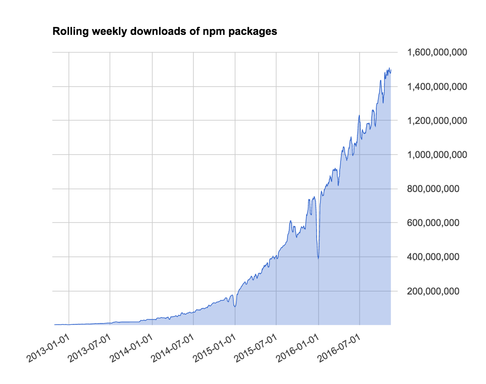
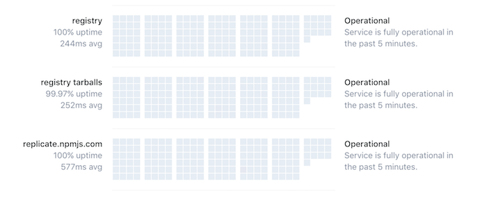

# Registry or repository - the right tool for the job

You may know that it’s possible to publish and work with packages stored on version control
hosting, such as GitHub, BitBucket, or GitLab. Based on this, you may wonder whether to use
such a repository as your own npm package registry. You wouldn’t be the first person with that idea!

This post helps explain the implications of using version control hosting for packages, and answers some
common questions that come up when you’re considering how best to help your collaborators discover
and re-use packages.

## Wait, you can do that? (Yes.)

npm is a package manager for many (mostly web dev-y, javascript-y) things, which is
to say that npm is a collection of humans and software that make publishing and
using things called ["packages"](https://docs.npmjs.com/how-npm-works/packages)
easier for other humans and software.

Part of npm consists of a registry, where a lot of the
packages that npm users install live — 379,000+, in fact — but this is not where _all_ of 
them live.

As part of our commitment to open source, npm has always allowed users to set up
alternative registries to which they can publish packages and from which they can install. In fact, this is 
a part of how [npm Enterprise](https://www.npmjs.com/enterprise) works,
and there are many alternative registries out in the wild.

## `git` Dependencies

In addition to using alternative registries, npm also supports using a
`git` address to point to packages stored on version control hosting such as GitHub,
BitBucket, or GitLab. You can use this functionality alongside the npm registry (or
another registry of your choosing). For example, you could have a `package.json` that
looks like this:

```json
{
  "name": "my-awesome-app",
  "version": "3.0.0",
  "description": "there's an app for that- and this is it!",
  "main": "index.js",
  "author": "ag_dubs <ashley@npmjs.com>",
  "license": "ISC",
  "dependencies": {
    "express": "^4.14.0",
    "my-secret-auth-package": "git@github.com:ashleygwilliams/my-secret-auth-package.git"
  }
}
```

If you and your company are already using GitHub, or something like it, for version
control, it might occur to you that using it as your package registry would be a 
simple solution — particularly if you’re already paying GitHub for private repositories!

A frequently asked question:

> _Why should I pay for private packages when I can simply use a private GitHub registry?_

The rest of this article aims to answer that question — but here’s a quick rundown:

- the npm Registry is specifically designed for serving packages
- the npm Registry allows you to easily take advantage of semantic versioning
- the npm Registry is faster than GitHub

## The Right Tool For the Job

> npm would be a terrible version control service.
> — C.J. Silvero, CTO, npm, Inc.

Remember how I described npm as a _collection of software and humans_? This was a 
deliberately strange move on my part. I made it primarily because many people do not realize
that npm extends beyond the CLI tool you use to type `npm install` into your terminal.
npm is a company — with many people, working on many things! The npm CLI is
just one project among many.

In fact, npm’s main product is the npm Registry, a very large and semi-elaborate set
of services that enable both the `npm` CLI client and the npm website to function. Long ago, the npm
Registry used to be a simple [Couch application](https://github.com/npm/npm-registry-couchapp)
built on top of [CouchDB](http://couchdb.apache.org/), but over the years, it has grown and
changed, specifically for the purposes of improving uptime and performance.

Even just a brief glance at some of the data around registry activity reveals
pretty awesome numbers. If you compare numbers from November 1, 2015 to November 1, 2016, you’d watch
the rolling 365-day downloads count jump from 18B to 52B, roughly 300% growth! And if you
think that number is big, go back one more year to 2014, when there were only 3.4B
rolling weekly downloads. I’ll do the math for you: that’s 1500% growth over just 2 years!



A growth in scale can often threaten the uptime of a service, but on that metric, the npm
registry has really shone. Current uptime is better than 99.95%.

If you want to check out the uptime on our services, take a look at http://ping.npmjs.com/.
(And for status issues, always check out http://status.npmjs.com).

[](http://ping.npmjs.com/)

## `git` vs npm Registry Showdown!

There’s no question that npm is specifically designed to serve all the uses a package
manager could need — but what about GitHub?

GitHub is a version control and collaboration product. Many of us
know and love it, but it *isn't* designed to be a package manager. Do those differing
product goals make a difference in feature set and performance? (Yep.)

### Semantic Versioning

In the above example, you might be quick to note that using a `git` dependency means
that you need to replace the semver range indication for that dependency.

One of the main
drawbacks to using a `git` dependency is that you can’t leverage [semantic versioning](http://semver.org). If you
use a `git` dependency, you can pin to a commit or a branch, but you can’t use the language
of semver to describe that decision. One of the drawbacks is that this makes it
much more difficult for you and other devs to communicate and understand the version of each
dependency your application needs. It also means that things like patch or minor release
updates to that dependency won’t automatically be brought into your application the way a
dependency that was specified as `^X.0.0` in your `package.json` (the default) might.

This means that using a `git` url to specify a dependency, instead of a language specifically designed to do it, 
takes more time, introduces more room for confusion, and will make your team less productive.

### `npm install` Performance

It’s true that not everyone loves semantic versioning — it’s a complicated and often
imperfect system, so losing that feature might not be a deal breaker for everyone. But assuming
you were willing to forego semantic versioning, the next question is: given that the npm
registry is *designed* for installs, what’s the difference in performance between installing
`git` dependencies vs. npm dependencies.

To answer the question, I wrote a test to see exactly what that difference was. You can find the code for
that test [here](https://github.com/ashleygwilliams/npm-git-benchmark).

I took two common and popular frameworks, `express` and `angular2`, copied their
`package.json`s, then made a version for each where I replaced all the primary
dependencies with `git` URLs. I then wrote a [shell script](https://github.com/ashleygwilliams/npm-git-benchmark/blob/432e434a61b1f8b44172223d3173a7cf78e8246b/benchmark.sh) which timed the following
sitations using the `time` utility:

- `npm install` with no cache (`npm cache clear`) on dependecies fetched from the npm registry
- `npm install --cache-min 999999` (using the cache) on dependencies fetched from the npm registry
- `npm install cache-min` with no cache (`npm cache clear`) on depedencies fetched from GitHub
- `npm install --cache-min 999999` (using the cache) on depdnecies fetched from Github 

In summary, this script runs a benchmark on the length of time an `npm install` takes depending
on whether the primary dependencies are git dependencies (fetched from GitHub) or
npm dependencies (fetched from the npm registry). For added comparison, it also runs
tests to see the effect caching has on both scenarios.

The goal of this benchmark was to motivate users to use the npm registry for their
packages, and in particular, to note the performance cost of using private git repos
instead of private npm packages.

As of 6 December 2016, these were the results, as run on TravisCI, using `Node 4.6.2`
and `npm 3.10.9` ([log file](https://api.travis-ci.org/jobs/181815771/log.txt?deansi=true)):

#### Install Time Results (seconds)

|                      | angular2 | express |
|----------------------|----------|---------|
| git with empty cache | 38.713  | 26.793  |
| npm with empty cache | 17.973   | 10.033  |
| git with all cached  | 29.228  | 16.223  |
| npm with all cached  | 13.403   | 7.197   |

### Faster, but by how much?

As you can see, applications using npm depdendencies were *much* faster than those using
`git` dependencies. But **how much faster**?

Let's calculate what percentage faster npm is compared to git using the following
assignments and calculation:

```
Tgit = installation time for git dependencies
Tnpm = installation time for npm dependencies

(Tnpm/Tgit) - 1 = x

... where x = the percentage (in decimal) that Tnpm is faster than Tgit
```

Applying this to the generated data we get

|                      | angular2 | express |
|----------------------|----------|---------|
| empty cache |   53.574% | 62.554%  |
| all cached  |   54.143% | 55.637% |

If we average these we'll find that on average, **using npm dependencies is around 56.5%
faster than using git dependencies**.

## Conclusion

So- what to conclude from all of this?

Firstly- if you didn't know that you could use `git` dependencies with npm, now you do! There
are plenty of good reasons to use `git` dependencies, and npm is commited to not only ensuring
that the CLI always supports them, but also to continuously improving the performance of 
installing them.

That being said- if your team is looking for improved performace and team communication, among
other boons, you'll want to leverage the npm registry. In summary, the npm registry offers
an improved performance over `git` dependencies because: 

- the npm Registry is specifically designed for serving packages
- the npm Registry allows you to easily take advantage of semantic versioning
- the npm Registry is faster than GitHub

If you're currently using private `git` repos as dependencies in your application, I'd strongly
encourage you to take a look at npm's private packages and orgs products- in addition to making
your team more productive, you'll be supporting the open source npm ecosystem and the
javascript community- and who doesn't like doing that?
